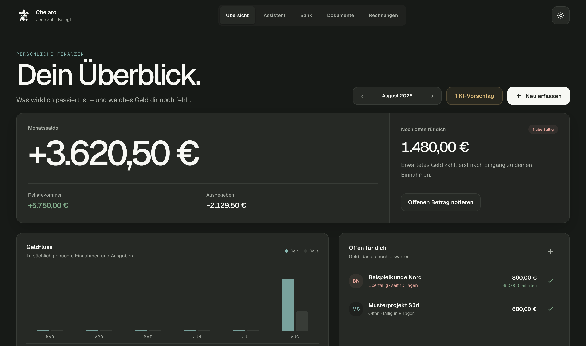
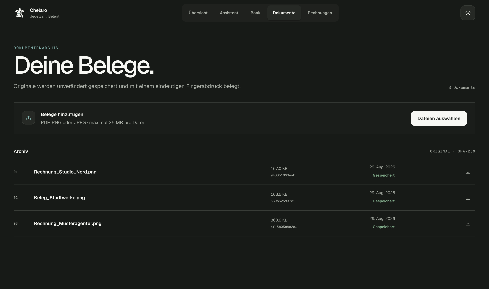
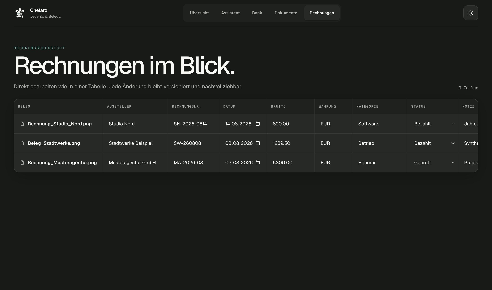
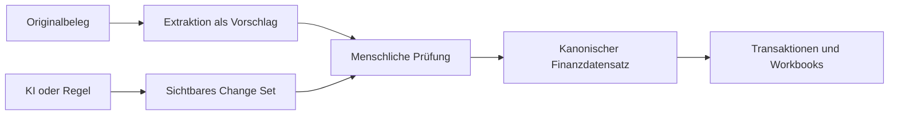

<p align="center">
  
</p>

<h1 align="center">Chelaro</h1>

<p align="center"><strong>Jede Zahl. Belegt.</strong></p>

<p align="center">
  Lokale, KI-gestützte Finanz- und Belegverwaltung für Menschen, die weniger verwalten wollen,<br />
  ohne Kontrolle über ihre Daten und Entscheidungen abzugeben.
</p>

<p align="center"><em>Öffentliche Source Preview · nicht produktionsreif · keine Downloads oder Releases · German-first</em></p>

<p align="center">
  <a href="#aktueller-stand">Produkt</a> ·
  <a href="#lokal-entwickeln">Schnellstart</a> ·
  <a href="docs/architecture/ARCHITECTURE.md">Architektur</a> ·
  <a href="SECURITY.md">Sicherheit</a> ·
  <a href="ROADMAP.md">Roadmap</a> ·
  <a href="docs/releases/RELEASE_PROCESS.md">Release-Grenzen</a>
</p>

---

Chelaro verbindet Rechnungen, Belege, Transaktionen, Forderungen und tabellenartige Finanzarbeit in
einem ruhigen, lokalen Arbeitsbereich. Jede relevante Zahl bleibt mit ihrer Quelle verbunden.
Automatische Extraktion, Regeln und KI erzeugen überprüfbare Vorschläge – kanonische
Finanzdaten entstehen erst durch deterministische Validierung oder eine bewusste Bestätigung.

> **Projektstatus:** Dies ist eine öffentliche, experimentelle Source Preview. Der Quellcode steht
> unter der PolyForm Noncommercial License 1.0.0; kommerzielle Nutzung erfordert eine separate
> schriftliche Lizenz. Das Repository ist **source-available und nicht Open Source**. Es gibt keine
> offiziellen Downloads, signierten Builds, Releases, Support- oder Produktionszusagen.

## Produktansicht

Alle gezeigten Namen, Dokumente, Rechnungsnummern und Beträge sind synthetische
Demonstrationsdaten. Logo, Hero und Screenshots wurden in Christopher Böbels Codex-Agent-Workflow
erstellt; Herkunft, Hashes und Nutzungsgrenzen stehen im
[Asset-Herkunftsregister](ASSET_PROVENANCE.md).

<p align="center">
  
</p>

<table>
  <tr>
    <td width="50%">
      
    </td>
    <td width="50%">
      
    </td>
  </tr>
  <tr>
    <td><sub>Unveränderte Originale mit Content Hash</sub></td>
    <td><sub>Versionierte Rechnungsarbeit mit sichtbarer Quelle</sub></td>
  </tr>
</table>

## Warum Chelaro

- **Quelle vor Behauptung** — Finanzwerte lassen sich bis zum Dokument, Import oder manuellen
  Eintrag zurückverfolgen.
- **Original bleibt Original** — abgeleitete Dateien und Metadaten ersetzen niemals das
  hochgeladene Dokument.
- **KI schlägt vor** — Automatisierung schreibt standardmäßig keine unsichtbaren Änderungen, sondern
  sichtbare Change Sets.
- **Lokal und privat** — Kernfunktionen arbeiten lokal und benötigen keinen verpflichtenden
  externen Modellanbieter.
- **Ruhige Präzision** — kompakte Finanzarbeit statt dekorativer Dashboard-Theatralik.

## Der Chelaro Trust Loop



Dieser Ablauf ist der Kern des Produkts: Automatisierung darf Arbeit reduzieren, aber niemals die
Herkunft einer Zahl oder die Autorität des Owners verdecken.

## Aktueller Stand

Die erste durchgängige Vertrauensschicht ist implementiert:

- unveränderliche Speicherung von PDF-, PNG- und JPEG-Originalen mit Content Hashes;
- persönlicher Überblick über Einnahmen, Ausgaben, Netto-Cashflow und offene Forderungen;
- Forderungen mit Fälligkeit, Teilzahlungen, Notizen und sichtbarer Korrekturhistorie;
- typisiertes, Excel-artiges Rechnungs-Workbook mit PostgreSQL-Persistenz;
- atomare, versionsgeprüfte Änderungen mit Audit Ledger;
- getrennte Owner- und KI-Credentials mit Proposal-only-Schreibzugriff;
- explizite Annahme oder Ablehnung von Änderungsvorschlägen;
- Vorbereitung einer lesenden FinTS-Verbindung ohne Speicherung von PIN oder TAN;
- persönlicher Finanzassistent mit expliziter Einwilligung, ChatGPT-Geräteanmeldung und flüchtigem
  Streaming-Chat;
- exakt acht typisierte Finanzwerkzeuge ohne Shell, Dateien, Web, Browser oder Coding-Funktionen;
- KI-Änderungen ausschließlich als prüfbare Vorschläge; bestehende Daten bleiben versionsgebunden;
- Electron-Source-Runtime für lokale Entwicklung auf macOS;
- vorbereiteter, derzeit nicht öffentlich freigegebener Update-Codepfad.

OCR, Transaktionsimporte, der Live-FinTS-Adapter, sichere lokale Credential-Ablage,
Backup-Automation und die paketierte Finance-Assistant-Integration befinden sich noch in
Entwicklung. Diese Preview darf nicht als einzige Aufbewahrung realer Finanzdokumente verwendet
werden.

## Architektur

| Bereich | Technologie | Verantwortung |
| --- | --- | --- |
| [`apps/web`](apps/web/README.md) | Next.js, React, TypeScript | Menschliche Finanz- und Review-Oberfläche |
| [`apps/api`](apps/api/README.md) | FastAPI, SQLAlchemy, PostgreSQL/SQLite | Kanonische Regeln, Persistenz und Auditierung |
| [`apps/desktop`](apps/desktop/README.md) | Electron, electron-builder | Lokale macOS-App, Runtime und Updates |
| [`apps/agent-host`](apps/agent-host/README.md) | TypeScript, Codex App Server | Einwilligungsgebundener Finanzchat und exakt acht begrenzte Finanzwerkzeuge |
| [`packages/agent-storage`](packages/agent-storage/README.md) | TypeScript | Historische Isolationsexperimente; nicht Teil des Finanzassistenten |
| [`infra/docker`](infra/docker/README.md) | Docker Compose | Reproduzierbare lokale Infrastruktur |

Der source-run Finanzassistent ist Bestandteil von `main`: Electron startet den Host, übergibt sein
Least-Privilege-Token erst nach Start per Parent-IPC und verbindet die Oberfläche über einen
separaten Same-Origin-Gateway-Proxy. Codex erhält weder Shell, Dateien, Webzugriff noch Coding-
Werkzeuge. Seine vier schreibenden Finanzwerkzeuge erzeugen ausschließlich nicht-kanonische,
prüfpflichtige Vorschläge; Änderungen bestehender Daten bleiben versionsgebunden. Die Freigabe im
signierten Paket ist noch nicht abgeschlossen. Der REST-Zugriff für lokale externe Agents bleibt
davon getrennt.

Interne Namen wie das `FINANCE_OS_*`-Konfigurationspräfix und das Python-Paket
`finance_os_api` bleiben vorerst als Kompatibilitätsgrenze bestehen. Die öffentliche Produktmarke
ist **Chelaro**.

## Lokal entwickeln

### Voraussetzungen

- Node.js 24 oder neuer
- pnpm 10.32.1
- Python 3.13 und `uv`
- Docker Desktop

### Einrichtung

```bash
cp .env.example .env
cp apps/web/.env.example apps/web/.env.local
pnpm install --frozen-lockfile
uv sync --project apps/api --locked --all-groups
pnpm infra:up
pnpm migrate:api
```

Die Platzhalter in beiden Environment-Dateien müssen ersetzt werden. Owner-Token in API und Web
müssen identisch sein; Agent- und Finance-Assistant-Token müssen davon und voneinander verschieden
sein. Beim normalen Desktop-Start werden Owner-, Finance-Assistant- und Gateway-Capabilities frisch
erzeugt; das Gateway-Token gehört nie in eine Environment-Datei.

API und Web-Oberfläche werden in getrennten Terminals gestartet:

```bash
pnpm dev:api
pnpm dev:web
```

Anschließend ist Chelaro unter [http://127.0.0.1:3000](http://127.0.0.1:3000) erreichbar.

## Lokale macOS-Source-Runtime

Die Entwicklungs-App startet PostgreSQL, führt ausstehende Migrationen aus, baut die lokalen
Dienste und öffnet Chelaro in einem isolierten Electron-Fenster:

```bash
pnpm dev:desktop
```

Die Preview veröffentlicht keine DMG-, ZIP- oder sonstigen Binärartefakte. Vorhandene
Paketierungs- und Releasepfade sind Entwicklungsstand, kein unterstützter Installationsweg und
keine Zusage eines späteren Releases.

### Datenpfad

Aus Kompatibilitätsgründen mit Installationen unter dem früheren Arbeitsnamen verwendet Chelaro
weiterhin:

```text
~/Library/Application Support/Finance OS/data/
```

Dieser Pfad darf bei einer App- oder Repository-Umbenennung nicht automatisch gelöscht oder
verschoben werden.

## Updates und Releases

Für diese Source Preview existieren kein öffentlicher Updatekanal, keine signierten Downloads und
keine GitHub Releases. Der vorhandene Update-Code ist deaktivierte Entwicklungsarbeit und darf
nicht als verfügbare Produktfunktion dargestellt werden.

## Sicherheit und Datenintegrität

- Keine echten Kunden-, Bank- oder persönlichen Finanzdaten in Fixtures, Snapshots, Logs oder
  Commits.
- Keine `.env`-Dateien, Credentials, Tokens, Cookies oder signierten URLs im Repository.
- Dokumentinhalte gelten als nicht vertrauenswürdige Daten und niemals als ausführbare
  Anweisungen.
- Geldbeträge verwenden Dezimalwerte mit expliziter ISO-Währung, keine binären Floats.
- Jede persistierte Mutation erzeugt im selben Vorgang ein Audit Event.
- Das Entfernen einer Workbook-Zeile löscht niemals das verknüpfte Originaldokument.

Lokales PostgreSQL lauscht ausschließlich auf `127.0.0.1`. Ein normales `pnpm infra:down` erhält
das Docker-Volume; das Löschen des Volumes oder des Datenverzeichnisses löscht lokale Daten.

## Qualität

Alle regulären Gates werden gemeinsam ausgeführt:

```bash
pnpm quality
```

Der Gate umfasst Repository-Sicherheitsprüfungen, Linting, Typprüfung, Tests, Produktions-Web-Build,
Dependency-Audits sowie portable Prüfungen für Agent Host und Agent Storage. Die realen
App-Server- und Isolationstests laufen wegen ihrer fest geprüften Plattformgrenze separat auf dem
unterstützten macOS-15.6-Apple-Silicon-System:

```bash
pnpm quality:agent:macos
```

## Dokumentation

- [Architekturübersicht](docs/architecture/ARCHITECTURE.md)
- [Threat Model](docs/security/THREAT_MODEL.md)
- [Roadmap](ROADMAP.md)
- [Changelog](CHANGELOG.md)
- [macOS Release-Prozess](docs/releases/RELEASE_PROCESS.md)
- [Repository-Betrieb](docs/operations/REPOSITORY.md)
- [Prüfung für eine öffentliche Source-available-Freigabe](docs/operations/PUBLIC_RELEASE_REVIEW.md)
- [Entwurf der v0.1.0 Release Notes](docs/releases/v0.1.0.md)
- [Produkt- und Entwicklungs-Blueprint](docs/product/FINANCE_OS_PRODUCT_BLUEPRINT.md)
- [Produktentscheidungen](docs/product/PRODUCT.md)
- [REST-Zugriff für lokale Agents](docs/agents/REST_ACCESS.md)
- [Architekturentscheidungen](docs/decisions/README.md)

## Zusammenarbeit und Betrieb

- [Beitragen](CONTRIBUTING.md)
- [Sicherheitsrichtlinie](SECURITY.md)
- [Support](SUPPORT.md)
- [Lizenzierung](LICENSE.md)
- [Kommerzielle Lizenzierung](COMMERCIAL-LICENSE.md)
- [Marke und visuelle Assets](BRAND_ASSETS.md)
- [Herkunft visueller Assets](ASSET_PROVENANCE.md)
- [Drittanbieterhinweise](THIRD_PARTY_NOTICES.md)

## Lizenzierung

Der Chelaro-Quellcode ist **source-available** unter der
[PolyForm Noncommercial License 1.0.0](LICENSE.md). Nichtkommerzielle Nutzung, Änderung und
Weitergabe sind innerhalb der Lizenzbedingungen erlaubt. Kommerzielle Nutzung ist nicht umfasst
und erfordert vorab eine [separate schriftliche Lizenz](COMMERCIAL-LICENSE.md).

Die Marke Chelaro und die enthaltenen visuellen Assets sind von der Softwarelizenz ausgenommen.
Für ihre Anzeige im Zusammenhang mit Chelaro gilt die gesonderte
[Marken- und Assetrichtlinie](BRAND_ASSETS.md). Drittanbieterkomponenten behalten ihre eigenen Lizenzen;
relevante Hinweise stehen in den [Drittanbieterhinweisen](THIRD_PARTY_NOTICES.md).

Dieses Modell ist bewusst keine OSI-anerkannte Open-Source-Lizenz, weil es kommerzielle Nutzung
einschränkt.

## Entwicklungsstatus

Chelaro ist experimentelle Finanzsoftware in aktiver Entwicklung. Der öffentliche Stand ist eine
Source Preview und weder fertige noch produktionsreife Finanzsoftware. Er ist keine
Steuer-, Rechts- oder Anlageberatung und darf nicht als einzige Aufbewahrung realer Dokumente oder
als Grundlage kritischer Finanzentscheidungen verwendet werden.

Entwickelt von **Christopher Böbel** im Austausch mit der Community.
