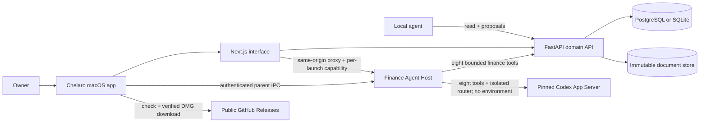
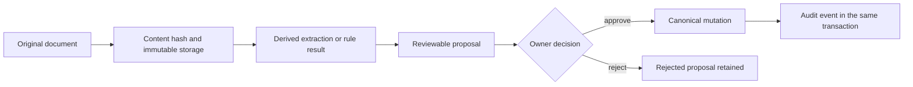

# Chelaro Architecture

Status: Öffentliche Source Preview · source-available, nicht Open Source · 29 August 2026

Chelaro is a local-first financial workspace. Its architecture separates original evidence,
canonical financial records, and unverified automation so that convenience never silently changes
the source of truth.

## System context

The packaged macOS application starts the API and web runtime on dynamically allocated loopback
ports. It generates a runtime owner token in memory and keeps the established local data path for
compatibility with earlier builds.

## Containers and responsibilities

| Container | Path | Responsibility | Trust level |
| --- | --- | --- | --- |
| Web interface | `apps/web` | Human review, same-origin mutations, local API proxy | Owner-facing |
| Domain API | `apps/api` | Authorization, validation, canonical rules, persistence, audit events | Canonical boundary |
| Desktop shell | `apps/desktop` | Isolated Electron window, local runtime, verified manual DMG updates | Local launcher |
| Finance Agent Host | `apps/agent-host` | Verify and drive pinned Codex; enforce consent, session binding, budgets, and the exact eight-function finance surface | Trusted local control plane |
| Document store | Configured local path | Content-addressed PDF, PNG, and JPEG originals | Immutable evidence |
| Database | PostgreSQL or SQLite | Financial records, proposals, versions, audit history | Canonical state |
| Docker infrastructure | `infra/docker` | Reproducible development PostgreSQL | Development only |

## Trust loop

Deterministic validation may create canonical data directly only where the domain contract permits
it. OCR, rules, and agent output remain non-canonical until an explicit authority boundary accepts
them.

## Access paths

### Owner

The Next.js server uses an owner bearer token to call the local API. Browser mutations must be
same-origin JSON requests. Owner-only API dependencies protect canonical write routes.

### Local REST agents

An agent receives a separate token. It may read allowed financial state and create typed change
proposals, but it cannot perform owner-only bookings directly. Tokens are compared using constant-
time comparison.

### Personal finance assistant

Electron generates a separate per-launch `finance_assistant` API capability. The Finance Agent
Host receives it only after startup over inherited parent IPC; it is absent from argv, startup
environment, the renderer, and the Codex child environment. Next.js receives only the owner token
and a different per-launch gateway capability. Its explicit same-origin routes are the renderer's
only path to the loopback Host gateway.

The Host discovers the supported system Codex CLI, starts its App Server with the user's normal
`HOME`/`CODEX_HOME`, and checks the existing login using `account/read` after consent. It never
reads or mutates the credential files and does not implement login or logout. Missing or unsupported
Codex installations degrade only the assistant. Before thread creation the Host uses `config/read`
to enumerate bounded MCP identifiers and disables each inherited server in the thread override;
the configuration is neither returned to the UI nor persisted. The finance thread still has no execution
environment and exposes exactly eight dynamic finance functions. GPT-5.6 is code-mode-only for tool
use, so Chelaro enables the pinned isolated Code Mode Host solely as a router to those functions.
The router has no Node, shell, file, process, import, environment-variable, or network capability.
Those tools expose bounded typed
projections and proposal creation only. They never expose original documents, OCR, bank access,
owner mutations, arbitrary HTTP, files, shell, browser control, MCP, or plugins.
Every call is bound to the active session, turn, call ID, consent version, and budget. Typed finance
fields remain untrusted prompt content. The App Server itself remains a trusted same-user control-
plane dependency; this residual risk and the shared-login boundary are accepted in ADR 0011.

Chelaro stores the complete visible user/assistant transcript in its own local database and keeps an
opaque Codex thread binding per conversation. New provider threads are persistent; later app epochs
resume that exact thread with the same restrictive contract and without hydrating provider turns
into the UI. The renderer reads paginated Chelaro history independently of Agent Host availability.
Reasoning, stream chunks, raw finance-tool results, and raw provider activities are never persisted.
Conversation mutations and terminal turns emit content-free audit events in the same transaction.
ADR 0013 defines deletion and consent semantics for this dual local store.

### Desktop renderer

Electron runs with context isolation and sandboxing enabled and Node.js integration disabled.
Navigation remains on the local Chelaro origin; new windows and external navigation are denied. Update IPC accepts
messages only from the current Chelaro renderer.

## Storage model

- Uploads enter a private quarantine directory and are streamed with a size limit.
- File type is detected from content bytes instead of trusting the supplied MIME type.
- Accepted originals receive a SHA-256 content address and are committed without rewriting bytes.
- Database rows reference the storage key; removing a derived row never deletes the original.
- Money is represented as decimal values with an explicit ISO currency.
- Version checks reject stale workbook and proposal mutations.

## Deployment modes

| Mode | Database | Runtime |
| --- | --- | --- |
| Local development | PostgreSQL in Docker | Separate API and Next.js processes |
| Packaged macOS app | SQLite below the compatible Finance OS data path | Embedded API and standalone Next.js runtime |
| CI | PostgreSQL service plus isolated test storage | GitHub-hosted runners |

The two database modes share domain models and rules but use different schema mechanisms:
PostgreSQL uses Alembic migrations, while the packaged SQLite runtime uses the versioned
`desktop_schema` bootstrap. Desktop-specific tests verify repeatable SQLite initialization and exact
money storage; CI validates PostgreSQL migrations and rollback parity.

## Release boundary

The free public macOS build is deliberately unsigned. A protected tag workflow publishes one
versioned Apple-Silicon DMG and `SHA256SUMS.txt`; the client accepts only the fixed Chelaro GitHub
repository, a higher stable Semantic Version, exact asset names, trusted HTTPS download hosts, the
declared byte size, and the matching SHA-256 digest. The user explicitly downloads, opens, and
installs the DMG. macOS Gatekeeper may require a manual override because checksum verification does
not establish Apple Developer-ID trust.

See [Release Process](../releases/RELEASE_PROCESS.md) and
[Threat Model](../security/THREAT_MODEL.md).

## Known gaps

- automated backup and tested restore are not implemented;
- local database encryption and Keychain-backed credential storage are not implemented;
- locally retained assistant transcripts are therefore private-by-permissions but not encrypted at
  rest;
- OCR is still in development;
- the Finance Assistant is verified in a local unsigned macOS 15.6 arm64 package and remains
  fail-closed without the exact supported Codex CLI; a signed public package is still pending;
- seamless in-place macOS updates remain unavailable until a future release decision funds and
  configures Apple Developer-ID signing and notarization;
- a compromised local operating-system account is outside the current protection boundary.

Architecture changes that affect an invariant require an ADR in `docs/decisions`.
