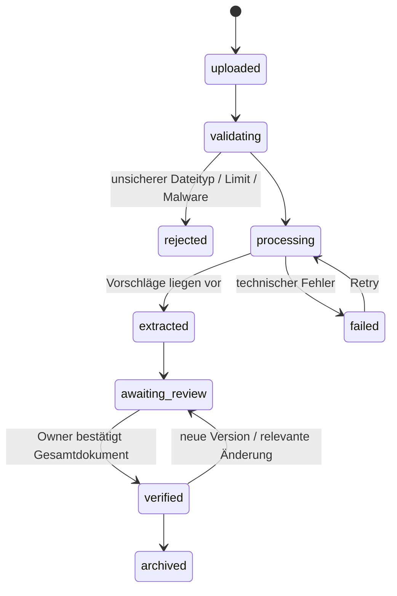
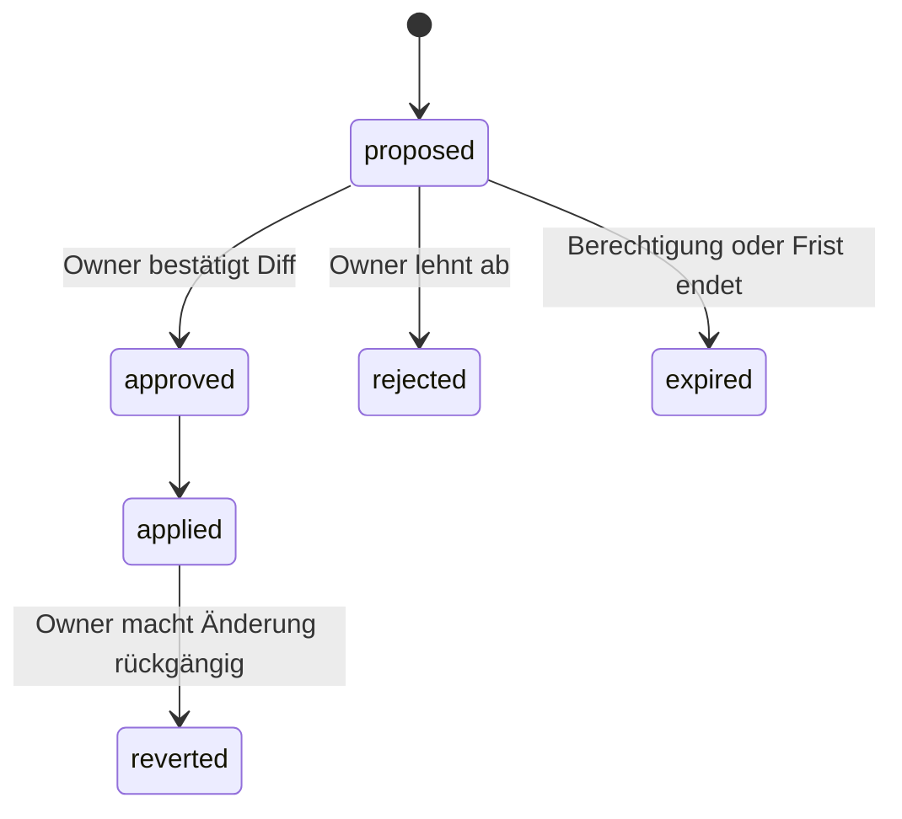
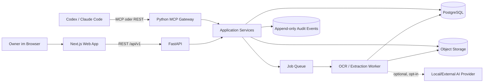
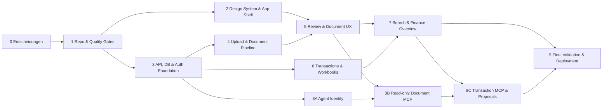

# Chelaro — Produkt- und Entwicklungs-Blueprint

Status: Planungsentwurf v1  
Datum: 13. August 2026  
Produktname: **Chelaro**
Ziel: Persönliches Finanz- und Belegsystem mit sicherem, nachvollziehbarem Zugriff für Menschen und AI Agents.

## 1. Entscheidung in einem Satz

Wir bauen kein überladenes Finanz-Dashboard, sondern ein ruhiges, vertrauenswürdiges Finanzarchiv mit Excel-artigen Arbeitsflächen: Dokumente und Transaktionen werden importiert, strukturiert, geprüft, in Finance Workbooks bearbeitet, miteinander verknüpft und über Web-UI, versionierte API und MCP für Agents nutzbar gemacht. Schreibende Agenten erzeugen standardmäßig nur Änderungsvorschläge; der Mensch bestätigt den sichtbaren Zell-/Datensatz-Diff.

## 2. Produktdiagnose

### Für wen?

Primär für eine einzelne Person, die private Finanzen und Belege zentral verwalten möchte und Codex, Claude Code oder andere Agents als Arbeitswerkzeuge nutzt.

Sekundär – später – für Haushalte, Freelancer und kleine Unternehmen. Diese Zielgruppen werden im MVP noch nicht gemeinsam optimiert, weil Rechte, Buchhaltungsregeln und Kollaboration den Produktkern stark verändern würden.

### Welches Problem lösen wir?

- Rechnungen, Quittungen, Kontoauszüge und Verträge liegen in E-Mails, Ordnern und Cloud-Speichern verteilt.
- Finanzdaten müssen wiederholt manuell übertragen und kategorisiert werden.
- Klassische Finance-Apps zeigen viele Diagramme, können Antworten aber selten bis zur Originalquelle belegen.
- AI Agents erhalten entweder gar keinen Zugriff oder zu viel unkontrollierten Zugriff auf sensible Daten.
- Automatische Extraktion ist ohne sichtbare Konfidenz, Herkunft und Korrekturpfad nicht vertrauenswürdig.

### Warum jetzt?

- OCR, strukturierte Extraktion und lokale/optionale LLMs können heute in einer belastbaren Pipeline kombiniert werden.
- MCP bietet einen standardisierten Agentenzugang zu Ressourcen und Werkzeugen.
- Next.js und FastAPI ermöglichen eine schnelle, klar getrennte Web-/API-Architektur.
- Der Nutzer erwartet Datenhoheit und möchte seine Daten aktiv mit Entwicklungs-Agents verwenden können.

### Die 10-Sterne-Version

Alle Finanzquellen laufen in einem privaten System zusammen. Neue Dokumente werden zuverlässig erkannt und – erst nach nachgewiesener, kalibrierter Qualität – risikobasiert zur Prüfung vorgelegt. Jede Zahl und jede AI-Antwort verweist auf ihre Provenienz. Budgets, wiederkehrende Zahlungen, Verträge, Vermögen, Verpflichtungen und Prognosen sind verbunden. Agents können komplexe Aufgaben erledigen, aber keine unsichtbaren oder irreversiblen Änderungen vornehmen.

### Kleinster Trust Prototype, der die These beweist

1. PDF/Bild hochladen.
2. Datei sicher verarbeiten und relevante Rechnungsfelder extrahieren.
3. Alle extrahierten Pflichtfelder in einer schnellen Prüfansicht bestätigen oder korrigieren.
4. Das verifizierte Dokument speichern und durchsuchen.
5. Einen Agenten eine Finanzfrage beantworten lassen – mit Quellenbeleg.

CSV-Transaktionen, Matching und schreibende Agentenvorschläge folgen erst im **MVP 1.0**, nachdem dieser Trust Loop messbar funktioniert.

### Anti-Ziele des MVP

- Keine Steuerberatung oder verbindliche Buchhaltungsautomatik.
- Keine Zahlungen, Überweisungen oder Kartenverwaltung.
- Keine autonome Agenten-Schreibberechtigung als Standard.
- Keine direkte Bank-Synchronisierung; zuerst CSV/standardisierte Importe.
- Keine komplexe Mehrmandanten-, Team- oder Steuerberater-Rollenlogik.
- Kein frei konfigurierbarer Dashboard-Baukasten.
- Kein Chat als Ersatz für eine gute, direkte Benutzeroberfläche.
- Kein vollständiger Excel-Klon im MVP: keine Makros, VBA, beliebige Scripts oder unkontrollierte Formeln.
- Keine automatische Dokumentlöschung durch Tabellen- oder Agentenaktionen.

### Erfolgsmetriken

- Median von Upload bis geprüftem Datensatz: unter 60 Sekunden menschliche Arbeitszeit.
- Ein versioniertes Eval-Korpus von mindestens 200 anonymisierten/synthetischen Dokumenten, zunächst Deutsch/Englisch und mindestens vier Rechnungs-/Belegtypen.
- Extraktionsqualität wird pro Feld gemessen: Exact Match/Precision/Recall, Abstention Rate und Kalibrierungsfehler (ECE/Brier), nicht als verschleierter Gesamtwert. Betrag, Währung, Partei und Datum erhalten eigene Abbruchschwellen.
- Nach menschlichem Sign-off stimmen 100 % der kanonischen Pflichtfelder mit der sichtbaren Bestätigung überein; vor Review darf kein Wert als verifiziert erscheinen.
- Mindestens 90 % der häufigen Dokumente in höchstens zwei Interaktionen auffindbar.
- 100 % der Agentenänderungen mit Akteur, Zeitpunkt, Vorher/Nachher und Quelle im Audit-Log.
- 0 unbestätigte Agentenänderungen im Standardmodus.
- Keine Originaldatei wird durch OCR, Extraktion oder Bearbeitung überschrieben.

## 3. Produktprinzipien

1. **Quelle vor Behauptung** — Jede Finanzzahl und jede AI-Antwort kann auf ihre Provenienz zurückgeführt werden: Dokument/Seite/Textstelle, CSV-Importzeile oder gekennzeichnete manuelle Erfassung.
2. **Originale sind unveränderlich** — Verarbeitete Versionen werden zusätzlich gespeichert; niemals statt des Originals.
3. **Progressive Offenlegung** — Nur die nächste relevante Entscheidung wird gezeigt. Details erscheinen erst bei Bedarf.
4. **Korrektur statt Konfiguration** — Das System lernt aus kleinen Korrekturen; der Nutzer soll keine Regelmaschine pflegen müssen.
5. **AI ist optional** — Grundfunktionen, OCR, Suche und manuelle Verwaltung funktionieren ohne externen LLM-Anbieter.
6. **Lesen ist nicht Schreiben** — Agentenrechte sind fein granular, zeitlich begrenzbar und standardmäßig read-only.
7. **Offene Datenwege** — Export, versionierte API und MCP verhindern Lock-in.
8. **Ruhige Präzision** — Hohe Informationsqualität, wenig visuelles Rauschen, keine dekorative Dashboard-Theatralik.

## 4. Capability Contract

### Capability

Eine authentifizierte Person kann Finanzdokumente und Transaktionsdaten in einem privaten System erfassen, die maschinell vorgeschlagenen Strukturen überprüfen, ihre Daten in Excel-artigen Finanztabellen bearbeiten, Quellen und Änderungen nachvollziehen und ausgewählten AI Agents einen begrenzten Lese- oder Vorschlagszugriff geben.

### Akteure

- **Owner**: besitzt alle Daten, verwaltet Zugriffe und bestätigt sensible Änderungen.
- **Web Client**: primäre menschliche Oberfläche.
- **Processing Worker**: validiert, scannt, normalisiert, OCRt und extrahiert Dateien.
- **AI Extractor**: optionaler, austauschbarer Anbieter für strukturierte Vorschläge.
- **Agent Client**: Codex, Claude Code oder anderer MCP/API-Client.
- **Operator**: betreibt Deployment, Backups und Wiederherstellung; im MVP meist identisch mit Owner.

### Dokumentzustände



Pflichtinvarianten:

- Das Original ist nach erfolgreichem Upload immutable.
- Jeder abgeleitete Inhalt referenziert Dokumentversion und Extraction Run.
- OCR-, Regel- und AI-Ergebnisse landen zunächst ausschließlich als Vorschläge in einem Staging-Modell; kanonische Finanzdaten entstehen erst durch deterministische Validierung oder menschliche Bestätigung.
- `verified` bedeutet explizit durch den Owner fachlich bestätigt, nicht nur technisch verarbeitet. Im Trust Prototype gibt es keine automatische Verifizierung.
- Betrag, Währung, Partei, Datum und sensible Zahlungsfelder bleiben beim Sign-off sichtbar, auch wenn ihre Extraktion als sicher gilt.
- Ein technischer Retry erzeugt keinen doppelten Datensatz.
- Löschen folgt einer dokumentierten Retention-/Recovery-Regel: Inhalte und direkt personenbezogene Metadaten werden nach Ablauf der Recovery-Frist physisch entfernt; im Audit verbleibt nur ein minimiertes, nicht rekonstruierbares Löschereignis.

### Änderungsvorschläge von Agents



- Ein Proposal enthält erwartete Datensatzversion, Vorher/Nachher, Begründung und Quellen.
- Optimistic Concurrency verhindert, dass ein veralteter Vorschlag neuere Änderungen überschreibt.
- `changes:execute` bleibt ein späterer, bewusst aktivierter Scope; MVP nutzt `changes:propose`.

### Capability: Finance Workbooks

Finance Workbooks sind Excel-artige, gespeicherte Tabellenansichten über kanonische Finanzdaten. Die Tabelle ist Arbeitsfläche, nicht alleinige Datenquelle.

Pflichtinvarianten:

- System-Sheets wie **Rechnungen**, **Transaktionen** und **Ausgaben** zeigen dieselben kanonischen Datensätze wie Detailansicht, Suche und API; es gibt keine unabhängige Schattenkopie.
- Eine Rechnungszeile referenziert das gespeicherte Originaldokument. Zell-, Zeilen-, Filter- oder Formeländerungen überschreiben oder löschen niemals PDF/JPG.
- Das Löschen oder Entfernen einer Tabellenzeile löscht kein Originaldokument. Dokumentlöschung ist ein eigener, expliziter Zwei-Schritt-Flow außerhalb der Tabelle; Agents erhalten im MVP keinen Lösch-Scope.
- Menschliche Direktbearbeitung und bestätigte Agentenänderungen erzeugen versionierte Change Sets mit Akteur, Zeitpunkt, betroffenen Zellen, Vorher/Nachher und optionaler Quelle.
- Mehrzellenänderungen sind atomar: vollständig anwenden oder gar nicht.
- Formeln sind berechnete Ansichten und verändern keine Quelldaten. Im MVP sind nur deterministische, sichere Funktionen erlaubt; keine Makros, Scripts, Netzwerkzugriffe oder beliebige Codeausführung.
- Ein veraltetes Agenten-Change-Set darf keine inzwischen manuell veränderte Zelle überschreiben.

### Fehler- und Recovery-Versprechen

- Uploads und Jobs sind idempotent und wiederholbar.
- Fehlgeschlagene Verarbeitung bleibt sichtbar und kann ohne Neu-Upload erneut gestartet werden.
- Originale, strukturierte Daten und Audit-Log werden getrennt gesichert.
- Wiederherstellung wird automatisiert getestet, nicht nur dokumentiert.
- Der Benutzer erhält klare, nicht-technische Fehlertexte mit konkreter nächster Aktion.

## 5. Feature-Schnitt

### Trust Prototype — Vertrauen beweisen

#### Inbox und Dokumente

- Drag-and-drop sowie Dateiauswahl für PDF und JPG; PNG und HEIC folgen im MVP 1.0.
- Upload-Fortschritt, Duplikaterkennung über Content-Hash und verständliche Fehlerzustände.
- OCR und strukturierte Extraktion für:
  - Absender/Lieferant
  - Dokumenttyp
  - Rechnungsnummer
  - Rechnungs- und Fälligkeitsdatum
  - Währung
  - Netto-, Steuer- und Bruttobetrag
  - Steuerzeilen/Steuersatz, sofern vorhanden
  - IBAN/Zahlungsreferenz als sensible optionale Felder
- Konfidenz und Quellenmarke pro Feld.
- Review Queue mit explizitem Gesamtsign-off; unsichere Felder sind priorisiert, kritische Pflichtfelder bleiben immer sichtbar.
- Original, normalisierte Ansicht, OCR-Text und Metadatenversionen.
- Volltextsuche plus kleine Filtermenge nach Zeitraum, Partei, Typ und Status.

#### Agent Access im Trust Prototype

- Versionierte REST API mit OpenAPI.
- Read-only MCP für Dokumentsuche, Dokumentmetadaten und Monatsfragen ausschließlich über verifizierte Dokumentfelder.
- Getrennter, explizit bestätigter Scope für Dokumentvolltext; kein Rohdateizugriff im Prototype.
- Vollständiges serverseitiges Audit der Zugriffe innerhalb der eigenen Systemgrenze.

#### Datenhoheit im Trust Prototype

- Export von Dokumentmetadaten und Originaldateien.
- Originalrechnungen bleiben standardmäßig gespeichert, bis der Owner sie über den separaten Lösch-Flow entfernt oder bewusst eine Aufbewahrungsregel aktiviert; Tabellen- und Agentenaktionen lösen keine automatische Löschung aus.
- Endgültige Löschung nach definierter Recovery-Frist, einschließlich Suchindex und Ableitungen.
- Externe AI-Verarbeitung explizit opt-in; lokale/deterministische Verarbeitung bleibt möglich.

### MVP 1.0 — Finanzdaten verbinden

#### Finance Core

- Konten manuell anlegen.
- CSV-Transaktionen importieren, normalisieren, kategorisieren und bearbeiten.
- Dokumente mit Transaktionen verknüpfen; manueller Link und Match-Vorschlag.
- Kategorien und Tags.
- Monatsansicht mit Einnahmen, Ausgaben, Netto-Cashflow und offenen Fälligkeiten.
- Währungsbeträge korrekt und ohne Float-Arithmetik speichern.

#### Finance Workbooks im MVP

- Excel-artige Grid-Ansichten für **Rechnungen**, **Transaktionen** und **Ausgaben**.
- Direktes, typisiertes Bearbeiten von Zellen für Text, Datum, Geld, Kategorie, Status und Dokumentlink.
- Sortieren, Filtern, Gruppieren, Spalten ein-/ausblenden, Spaltenbreite und gespeicherte Ansichten.
- Copy/Paste aus und nach Excel sowie CSV-/XLSX-Import und -Export über eine kontrollierte Mapping-Vorschau.
- Mehrfachauswahl, Undo/Redo und atomare Massenänderungen.
- Begrenzte berechnete Spalten, zunächst `SUM`, `COUNT`, `IF`, `ROUND` sowie einfache Datums-/Betragsoperationen.
- Jede Rechnungszeile besitzt eine Quellenmarke und öffnet Originalbeleg oder passende Belegstelle im Inspector.
- Agenten können Tabellenbereiche lesen und ein hervorgehobenes Mehrzellen-Change-Set vorschlagen; Annahme/Ablehnung ist pro Zelle oder gesamtem Change Set möglich.
- Im MVP keine freie Arbeitsmappe mit beliebigen Zelltypen: Die ersten Sheets sind sichere Ansichten über kanonische Finanzentitäten.

#### Erweiterter Agent Access

- Python-MCP-Server über Streamable HTTP; stdio-Adapter für lokale Clients.
- Read-only Ressourcen und Tools für Transaktionen und Zusammenfassungen.
- Schreibende Tools erstellen Änderungsvorschläge.
- API-Tokens/Client-Zugriffe mit Scopes, Ablaufdatum und Widerruf.
- Audit-Log pro Agent, Tool Call und resultierender Änderung innerhalb des Servers.

#### Datenhoheit

- Export von Dokumentmetadaten, Transaktionen und Audit-Events als JSONL/CSV.
- Originaldateien als nachvollziehbares Archiv exportierbar.

### Release 1.1 — Alltagstauglichkeit

- Wiederkehrende Zahlungen und Vertrags-/Abo-Erkennung.
- Regeln, die aus bestätigten Korrekturen vorgeschlagen werden.
- Budgetierung und Ziele.
- Gespeicherte Sichten und intelligente Inbox-Regeln.
- E-Mail-Ingestion mit dedizierter Adresse/IMAP.
- PWA-Upload/Scan vom Smartphone.
- Mehrwährung mit expliziten Wechselkursquellen.
- Frei anlegbare Workbooks/Sheets mit typisierten Custom-Spalten, Cross-Sheet-Referenzen und Vorlagen – weiterhin ohne Makros oder beliebige Codeausführung.

### Später

- Open-Banking-Anbindung über einen regulierten Provider.
- Haushalts-/Teamzugriff mit granularen Rollen.
- Freelancer-/Geschäftsmodus, DATEV- oder Steuerexporte.
- Forecasting, Vermögen und Verbindlichkeiten.
- End-to-End-verschlüsselte Synchronisierung/echtes Local-first, falls Produktbedarf bestätigt.
- Vertrauensstufen für explizit erlaubte, direkt ausführbare Agentenaktionen.

## 6. UX- und Designrichtung: „Quiet Ledger“

### Charakter

- **Zweck**: Finanzarbeit schnell erledigen und anschließend wieder verlassen.
- **Ton**: ruhig, präzise, warm, professionell, nicht bankbürokratisch.
- **Informationsdichte**: kompakt und scannbar; keine riesigen Überschriften oder verschachtelten Karten.
- **Memorable Detail**: Jede relevante Zahl besitzt eine kleine Quellenmarke. Klick oder Hover öffnet genau die passende Stelle im Beleg.

### Visuelles System

- Grundfläche: warmes Off-White statt hartem Weiß; Dark Mode in tiefem Graphit.
- Text: nahezu schwarzes Graphit, sekundäre Texte neutral grau.
- Primärakzent: zurückhaltendes Mineral-/Petrolblau für Fokus und bestätigte Aktionen.
- Semantik: gedämpftes Grün für bestätigt, Amber für Prüfung, Rot nur für Fehler/Risiko.
- Typografie: charaktervolle, sehr gut lesbare Sans für UI; Mono oder tabellarische Ziffern für Beträge, IDs und Daten.
- 4/8px-Spacing-Rhythmus; 1px-Divider; Radius meist 8–10px.
- Schatten nur für echte Ebenen wie Dialog, Popover oder schwebenden Inspector.
- Animationen 120–180ms, nur zur Orientierung; `prefers-reduced-motion` vollständig respektieren.
- Keine Purple Gradients, Glassmorphism-Flächen, Karten-in-Karten oder dekorativen Diagramme ohne Entscheidungskraft.

### Informationsarchitektur

Maximal fünf primäre Ziele:

1. **Heute** — Was braucht gerade Aufmerksamkeit?
2. **Dokumente** — Finden, ansehen, prüfen.
3. **Tabellen** — Rechnungen, Transaktionen und Ausgaben Excel-artig bearbeiten.
4. **Überblick** — Cashflow und Fälligkeiten.
5. **Suchen/Command** — globale direkte Navigation und Aktionen.

Settings, Agentenzugänge, Exporte und Administration liegen kontextuell hinter dem Profil-/Systemmenü.

### Kernansichten

#### Heute

- Kein generisches Dashboard.
- Oben genau eine priorisierte Aktion, z. B. „3 Dokumente prüfen“; daneben bleibt ein kompakter Sicherheitsstatus für aktive Agenten-Grants, ausstehende Änderungsvorschläge und fehlgeschlagene Backups auffindbar.
- Darunter nur zeitkritische Fälligkeiten und auffällige Importfehler.
- Finanzzusammenfassung klein und ruhig; Details erst nach Klick.

#### Review Queue

- Split View: Belegausschnitt links, unsichere Felder rechts.
- Fokus springt automatisch zur Quellenstelle.
- Tastatur: Enter bestätigt, Pfeile navigieren, Cmd/Ctrl+Enter schließt ab.
- Nichtkritische sichere Felder dürfen eingeklappt sein; Betrag, Währung, Partei, Datum und sensible Zahlungsfelder bleiben bis zum Gesamtsign-off sichtbar.
- Keine AI-Konfidenz als scheinpräziser Prozentwert ohne Nutzen; stattdessen klare Zustände: sicher, prüfen, Konflikt.

#### Dokumentdetail

- Dokument im Zentrum.
- Kompakte Metadatenleiste; sekundäre Details in einem einblendbaren Inspector.
- Verlauf, Agentenzugriffe und Versionen im Kontext, nicht als dauerhaft sichtbare Panels.

#### Workbook-Ansicht

- Startet mit nur den wichtigsten Spalten; weitere Spalten, Filter, Formeln und Gruppierungen erscheinen erst auf Wunsch.
- Tabs für Rechnungen, Transaktionen und Ausgaben; gespeicherte Ansichten statt kopierter Tabellen.
- Ruhiges, dichtes Grid mit tabellarischen Ziffern, eingefrorener Kopfzeile und stabilen Spaltenbreiten.
- Tastaturnavigation wie in einer Tabellenkalkulation: Pfeile, Enter, Tab, Copy/Paste, Mehrfachauswahl und Undo/Redo.
- Zeilenbearbeitung für schnelle Korrekturen; ein seitlicher Inspector zeigt seltene Felder und den verknüpften Originalbeleg.
- Quellenmarke direkt in relevanten Zellen; ein Klick springt zur passenden Rechnung oder Importzeile.
- Agentenänderungen erscheinen zunächst als Diff-Layer: alte Werte dezent durchgestrichen, Vorschläge hervorgehoben, Begründung und Quelle im Inspector.
- Der Owner kann einzelne Zellen oder das gesamte atomare Change Set annehmen oder ablehnen.
- Formeln zeigen Ergebnis und Herkunft, werden aber nicht als editierbare Quelldaten ausgegeben.
- Keine dauerhafte AI-Seitenleiste: Agentenaktionen erscheinen kontextuell in Toolbar, Auswahlmenü oder Change-Review.

#### Globale Suche

- Ein Suchfeld findet Dokumenttext, Parteien, Rechnungsnummern, Beträge und Transaktionen.
- Ergebnisgruppen werden erst gezeigt, wenn sie Treffer haben.
- Natürliche Fragen können später als eigene, quellenbasierte Aktion ergänzt werden; sie ersetzen die exakte Suche nicht.

### Accessibility und Responsiveness

- WCAG 2.2 AA als Abnahmekriterium.
- Vollständige Tastaturbedienung und sichtbare Fokuszustände.
- Mindestens 24×24 CSS-Pixel für Targets, wichtige Touch-Aktionen größer.
- Keine Statusbedeutung nur über Farbe.
- Semantisches HTML zuerst; ARIA nur wo nötig.
- Fokusmanagement für Dialoge und Inspector; Escape schließt und stellt Fokus wieder her.
- 400 % Zoom ohne Funktionsverlust.
- Das Grid nutzt semantische Tabellen-/Grid-Rollen, klare Zeilen-/Spaltenansagen und einen sichtbaren aktiven Zellfokus; keine rein Canvas-basierte Interaktion ohne zugängliche Alternative.
- Mobil: Bottom Navigation für Heute, Dokumente und Tabellen; Tabellen werden als kompakte Zeilenliste plus Zell-/Dokument-Inspector bearbeitet, nicht als unbrauchbar zusammengedrücktes Desktop-Grid.

## 7. Technische Zielarchitektur

### Stackentscheidung

- **Frontend**: Next.js 16, TypeScript, App Router, Server Components als Standard, kleine Client Components nur für Interaktion.
- **UI**: Tailwind CSS + eigene Tokens; zugängliche Headless-Primitives (z. B. Radix) gezielt statt eines visuell dominanten Komponentenframeworks.
- **Backend**: Python, FastAPI, Pydantic, SQLAlchemy 2 async, Alembic.
- **Agent Layer**: offizielles MCP Python SDK v2, dieselben Application Services wie REST – keine separate Geschäftslogik.
- **Datenbank**: PostgreSQL; Full-Text Search zuerst, `pgvector` erst bei nachgewiesenem RAG-Bedarf.
- **Dateien**: S3-kompatibler Object Store; MinIO lokal, austauschbarer EU-Region-Provider in Cloud.
- **Jobs**: Worker-Prozess mit langlebiger Queue; Celery/Redis ist die konservative Startoption, vor Implementierung gegen einfachere Postgres-Queue abwägen.
- **OCR**: OCRmyPDF/Tesseract plus PDF-Text-Extraktion; LLM-Extraktion als optionaler Adapter.
- **Tooling**: `pnpm` für Web, `uv` für Python, Docker Compose für lokale Infrastruktur.

PostgreSQL ist die Kontrollquelle für Zustände. DB-Mutation, Audit Event und Transactional-Outbox-Eintrag entstehen atomar. Worker verarbeiten Outbox-/Queue-Nachrichten idempotent; Object-Store-Uploads werden erst nach erfolgreicher Hash-/Metadaten-Transaktion finalisiert. Ein periodischer Orphan-Reaper entfernt nicht referenzierte temporäre Blobs. Restore-Tests prüfen einen konsistenten DB-/Object-Store-Zeitpunkt.

### Systemfluss



### Monorepo-Struktur

```text
finance-os/
├── apps/
│   ├── web/                 # Next.js
│   ├── api/                 # FastAPI + REST
│   ├── worker/              # OCR/Extraktion/Importjobs
│   └── mcp/                 # Python MCP Entry Points
├── packages/
│   ├── ui/                  # Tokens und geteilte UI-Primitives
│   └── api-client/          # aus OpenAPI generierter TS-Client
├── infra/
│   ├── docker/
│   └── migrations/
├── docs/
│   ├── product/
│   ├── architecture/
│   ├── decisions/           # ADRs
│   └── agent-contract/
├── evals/
│   ├── document-extraction/
│   └── agent-permissions/
└── .github/workflows/
```

### Frontend-Regeln

- Seiten und Layouts bleiben Server Components, solange kein Browser-State nötig ist.
- Form-, Review-, Tabellen- und Uploadinteraktion werden als kleine Client Islands gebaut.
- Nur ungefährliche Navigationszustände liegen in der URL. Parteien, Beträge, Rechnungsnummern, freie Suchtexte und sensible Dokument-IDs bleiben in kurzlebigem Session-/POST-State und werden aus Logs/Telemetry redigiert.
- Keine direkte Datenbanklogik in Next.js; FastAPI ist die fachliche Quelle.
- API-Typen werden aus OpenAPI generiert, nicht doppelt manuell gepflegt.
- Loading-, Empty-, Error- und Permission-States gehören zur Definition jedes Features.

### Backend-Regeln

- FastAPI bleibt eine dünne HTTP-Schicht über Application Services.
- Request-, Update- und Response-Schemas werden getrennt.
- Router, Services, Repositories und Worker nutzen dieselben Domänenregeln.
- Listen sind cursor-paginiert; Suchergebnisse können aus UX-Gründen zusätzlich Seiten anbieten.
- Jobs besitzen Idempotency Key, Retry Policy, Status und nachvollziehbaren Fehlercode.
- OpenAPI `/api/v1` ist der stabile Vertrag für UI, Integrationen und Agents.
- `Referrer-Policy: no-referrer` und keine Third-Party-Telemetrie auf authentifizierten Finanzseiten sind Defaults.

## 8. Datenmodell v1

### Kernentitäten

- `users`
- `accounts`
- `documents`
- `document_versions`
- `document_blobs`
- `processing_jobs`
- `extraction_runs`
- `extracted_fields`
- `parties`
- `transactions`
- `transaction_document_links`
- `categories`
- `tags` und `document_tags`
- `workbooks`
- `sheet_views`
- `computed_columns`
- `change_sets` und `change_operations`
- `agent_clients`
- `agent_grants`
- `change_proposals`
- `audit_events`

### Wichtige Modellregeln

- Geld als `numeric`, niemals Float; immer mit ISO-Währung.
- Zeitpunkte als `timestamptz` in UTC, Anzeige in Nutzerzeitzone.
- Dateien im Object Store, nur Hash, Größe, MIME, Storage Key und Verschlüsselungsmetadaten in Postgres.
- SHA-256 dient der Duplikaterkennung; fachliche Duplikate können zusätzlich heuristisch erkannt werden.
- `documents` ist die logische Identität, `document_versions` hält Original/abgeleitete Versionen.
- Extrahierte Felder speichern Wert, normalisierten Wert, Konfidenzklasse, Quelle, Modell/Regelversion und Bestätigungsstatus.
- Extrahierte Vorschläge und kanonische Felder sind getrennt modelliert; kein Worker schreibt ungeprüfte Ergebnisse direkt in `transactions` oder bestätigte Dokumentfelder.
- `sheet_views` speichern Spalten, Reihenfolge, Filter, Sortierung und Gruppierung; System-Sheets referenzieren kanonische Entitäten und duplizieren deren Werte nicht.
- `computed_columns` speichern eine validierte Formel-Definition/AST, nicht ausführbaren Code. Ergebnisse sind rekonstruierbarer Cache.
- `change_sets` bündeln menschliche oder agentische Mehrzellenänderungen; jede Operation referenziert Entität, Feld und erwartete Version statt instabiler sichtbarer Zeilen-/Spaltennummern.
- Rechnungs- und Tabellen-Lifecycle sind getrennt: Ein Sheet kann gelöscht oder eine Zeile ausgeblendet werden, während `documents` und `document_versions` unverändert erhalten bleiben.
- Audit Events sind append-only und enthalten keine unnötigen Dokumentvolltexte.
- Benutzer-/Mandanten-ID ist Teil jeder besitzenden Entität und jedes relevanten Index.
- Fremdschlüssel werden indexiert; Suchindizes werden aus echten Query-Pfaden abgeleitet.

## 9. REST- und Agentenvertrag

### REST-Ressourcen

```text
POST   /api/v1/documents/uploads
GET    /api/v1/documents
GET    /api/v1/documents/{id}
GET    /api/v1/documents/{id}/versions
POST   /api/v1/documents/{id}/reviews
POST   /api/v1/documents/{id}/reprocess
DELETE /api/v1/documents/{id}
POST   /api/v1/exports
GET    /api/v1/exports/{id}

GET    /api/v1/accounts
POST   /api/v1/accounts
GET    /api/v1/transactions
POST   /api/v1/transactions/imports
PATCH  /api/v1/transactions/{id}
POST   /api/v1/transactions/{id}/document-links

GET    /api/v1/workbooks
POST   /api/v1/workbooks
GET    /api/v1/workbooks/{id}/sheets
GET    /api/v1/sheets/{id}/rows
PATCH  /api/v1/sheets/{id}/rows/{row-id}
POST   /api/v1/sheets/{id}/imports
POST   /api/v1/sheets/{id}/exports
POST   /api/v1/sheets/{id}/change-proposals

GET    /api/v1/search
GET    /api/v1/finance/months/{yyyy-mm}/summary

GET    /api/v1/agent-clients
POST   /api/v1/agent-clients
POST   /api/v1/change-proposals
POST   /api/v1/change-proposals/{id}/approve
POST   /api/v1/change-proposals/{id}/reject
POST   /api/v1/change-proposals/{id}/revert
GET    /api/v1/audit-events
```

Upload antwortet mit `202 Accepted` und Job-/Dokumentstatus. Create-Endpunkte liefern `201` plus `Location`. `approve` prüft die erwartete Datensatzversion und wendet die Änderung samt Audit Event atomar an; Ablauf erfolgt serverseitig, Revert als neue kompensierende Version. Löschen startet die dokumentierte Recovery-/Purge-Lifecycle. Fehler nutzen ein stabiles, maschinenlesbares Envelope. Versionen werden über URL-Versionierung und semantische OpenAPI-Änderungsregeln verwaltet.

### MCP-Ressourcen

```text
finance://summary/{year}/{month}
finance://documents/{document_id}
finance://transactions/{transaction_id}
finance://sheets/{sheet_id}/schema
finance://review-queue
finance://audit/{event_id}
```

### MCP-Tools nach Reifegrad

Trust Prototype, read-only:

- `search_documents(query, filters, cursor)`
- `get_document(document_id, include_content=false)`
- `explain_amount(entity_type, entity_id, field)`

MVP 1.0, zusätzlich read-only:

- `list_transactions(filters, cursor)`
- `get_month_summary(year, month)`
- `list_finance_sheets()`
- `query_sheet(sheet_id, fields, filters, cursor)`

MVP 1.0, Vorschläge:

- `propose_document_update(document_id, expected_version, patch, reason, sources)`
- `propose_transaction_update(transaction_id, expected_version, patch, reason, sources)`
- `propose_document_transaction_link(document_id, transaction_id, reason)`
- `propose_sheet_changes(sheet_id, expected_versions, operations, reason, sources)`

### Scopes

- `documents:metadata:read`
- `documents:content:read`
- später, separat und kurzlebig: `documents:files:read`
- `transactions:read`
- `summaries:read`
- `sheets:read`
- `changes:propose`
- `audit:self:read`
- später und standardmäßig deaktiviert: `changes:execute`

### Agentensicherheitsregeln

- Dokumentinhalt wird als untrusted data behandelt, niemals als Instruktion.
- Tool-Beschreibungen nennen Seiteneffekte und Scope klar.
- Jede Antwort begrenzt Payload und nutzt Cursor.
- Rohdateien benötigen einen eigenen Scope und kurzlebige Signed URLs.
- Nach Ausgabe an einen Agenten kann das System weder Client-Logs noch Weiterverarbeitung oder Kopien kontrollieren. UI und Grant-Dialog benennen diesen Kontrollverlust ausdrücklich; Audit deckt nur serverseitige Zugriffe ab.
- Grants sind deny-by-default und zusätzlich auf Ressourcenmenge, Dokumente/Konten, Zeitraum, Felder und Zweck begrenzbar. Volltextzugriff wird separat bestätigt.
- Eine versionierte Endpoint/Tool × Scope × Ressource-Matrix ist ausführbarer Authorization-Vertrag und Teil der Tests.
- Lokale Tokens werden nur gehasht gespeichert, sind widerrufbar, rotierbar, mit Audience und kurzer Ablaufzeit versehen; lokale Clients speichern sie im OS-Keychain. Remote MCP nutzt den aktuellen OAuth-2.1-konformen Authorization Flow. „Clientbindung“ wird erst versprochen, wenn Proof-of-Possession implementiert ist.
- Ein Proposal kann nur auf der erwarteten Datensatzversion angewendet werden.
- Tabellenoperationen adressieren stabile Entitäts-ID plus Feld-ID, niemals nur sichtbare Koordinaten wie `B17`, die sich nach Sortierung ändern können.
- Row-/Cell-Limits gelten pro Tool Call und Change Set. Agenten dürfen im MVP weder Originaldokumente noch kanonische Datensätze über eine Tabellenoperation löschen.
- Der Audit-Eintrag enthält Agent Client, Scope, Tool, Request-ID, Resultat und Änderung.

## 10. Sicherheit, Datenschutz und Betrieb

### Privacy by Design

- Standardmäßig verlässt kein Dokument die eigene Deployment-Grenze.
- Externe OCR/LLM-Anbieter sind opt-in. Jeder Adapter besitzt einen prüfbaren Provider-Vertrag: gesendete Felder, Zweck, Region, Speicherung, Trainingsnutzung, Unterauftragsverarbeiter, Löschfrist, Abuse-/Fehlerlogs und Widerrufsmöglichkeit. Extraction Runs protokollieren Provider, Policy-Version und Consent.
- Datenminimierung für Logs, Telemetrie, Prompts und Exporte.
- Retention und endgültiges Löschen werden als Produktfunktionen definiert.
- Append-only Audit bedeutet nicht unbegrenzte Aufbewahrung personenbezogener Inhalte: Löschung hinterlässt nur ein minimiertes Tombstone-Ereignis ohne Originalwert.
- EU-Region für Cloud-Dienste als Standardempfehlung.
- Vor öffentlichem Betrieb: Datenschutzrollen, Rechtsgrundlage, AV-Verträge und ggf. DPIA mit Fachberatung klären.

### Daten-Lifecycle

| Datentyp | Aktiv | Löschung | Backup/Provider |
|---|---|---|---|
| Originale | immutable Version, verschlüsselt; Aufbewahrung bis explizite Owner-Löschung oder bewusst konfigurierte Retention | nur nach separatem Zwei-Schritt-Flow und Recovery-Frist physisch/crypto-erased | läuft nach definierter Backup-Retention aus |
| OCR/Ableitungen | an Dokumentversion gebunden | mit Dokument purgebar | keine längere Frist als Quelle |
| Suchindex | vollständig rekonstruierbar | sofort de-indexieren | nicht separat dauerhaft sichern |
| Quarantäne/Temp-Blobs | nicht benutzerseitig freigegeben | kurze feste TTL + Orphan-Reaper | kein Langzeitbackup |
| Audit | append-only, datenminimiert | Werte durch nicht rekonstruierbaren Tombstone ersetzen | Integrität erhalten, gleiche Rechts-/Retention-Prüfung |
| Exporte | kurzlebig, verschlüsselt, einmalig abrufbar | automatische TTL | kein Langzeitbackup |
| Externe Providerdaten | nur nach Consent | laut Provider-Vertrag/Widerruf | Providerbestätigung soweit verfügbar |

Vor Production werden konkrete Recovery-/Purge-Fristen, Backup-Auslauf, RPO, RTO und Key-Recovery im Betriebsprofil festgelegt. „Immutable“ bedeutet keine In-place-Änderung, nicht unendlich lange oder unlöschbar.

### Upload-Härtung

- Erlaubte Typen, Größe, Seitenzahl und Pixelgrenzen whitelisten.
- MIME anhand Inhalt prüfen, nicht nur Dateiendung.
- Viren-/Malwareprüfung und Schutz vor ZIP/PDF-Bombs.
- Parser/OCR in isoliertem Worker mit CPU-, Speicher- und Zeitlimits.
- Originale nicht direkt im Browser aus fremdem HTML rendern.
- Content-Disposition, CSP und Signed URLs restriktiv konfigurieren.
- Diese Kontrollen sind Voraussetzung für den ersten echten Upload und werden nicht bis zur Abschluss-Härtung verschoben.

### Auth und Autorisierung

- Sichere, HttpOnly/Secure/SameSite Cookies für Web Sessions.
- Passkeys oder OIDC gegenüber selbst gebautem Passwortsystem bevorzugen; finale Wahl hängt vom Hostingmodell ab.
- Autorisierung serverseitig bei jeder Ressource und nicht nur in der UI.
- Rate Limits für Login, Upload, Suche, AI und Agenten-Tools.
- Secret Scanning, Dependency Audits und reproduzierbare Lockfiles.

### Verschlüsselung und Backups

- TLS überall außerhalb rein lokaler Entwicklung.
- Verschlüsselung von Datenbank, Object Store und Backups at rest.
- Optional anwendungsseitige Envelope Encryption für besonders sensible Blobs in einer späteren Härtungsstufe.
- Verschlüsselte, versionierte Backups; dokumentierte Aufbewahrung.
- Regelmäßiger automatisierter Restore-Test mit Recovery-Ziel.

### Observability

- Strukturierte Logs ohne Dokumenttext, Tokens oder sensible Beträge, sofern nicht unbedingt nötig.
- Metriken: Queue-Länge, Jobdauer, Fehlerrate, Extraktionsqualität, Review-Zeit, API-Latenz.
- Health/Readiness getrennt.
- Trace-/Request-ID durch Upload, Job, Extraktion, Review und Agent Call.

## 11. Qualität und Evals

### Definition of Done für jede vertikale Einheit

- Akzeptanzkriterium erfüllt.
- Typecheck, Lint, Unit- und relevante Integrations-/E2E-Tests grün.
- Empty, Loading, Error und Permission State vorhanden.
- Accessibility-Check und Keyboard Flow geprüft.
- Keine Secrets oder sensiblen Daten in Code/Logs/Snapshots.
- API-/Datenmodelländerung dokumentiert und migrierbar.
- Relevanter Audit Event vorhanden.
- Commit ist klein, verständlich und reversibel.
- Negativtests für die dominante Risikoklasse sind grün; definierte Abbruchschwellen werden nicht überschritten.
- Keine sensiblen Werte in URL, Referrer, Client-Fehlertracking oder Test-Snapshots.

### Eval-Suiten

1. **Document Extraction**: versioniertes Korpus mit Ground Truth für Partei, Nummer, Datum, Währung, Netto, Steuer und Brutto; Reporting pro Feld mit Exact Match/Precision/Recall, Abstention und ECE/Brier.
2. **OCR Robustness**: Scans, Rotation, geringe Qualität, mehrere Sprachen, mehrseitige Belege.
3. **Duplicate/Idempotency**: identische Uploads, Retries, parallele Jobs.
4. **Authorization Matrix**: Owner, abgelaufener Token, read-only Agent, Proposal-Agent, fremde IDs.
5. **Agent Grounding**: Antworten müssen Quellen enthalten und dürfen fehlende Daten nicht erfinden.
6. **Prompt Injection**: Dokumenttext versucht Tool-Aufrufe oder Datenabfluss auszulösen.
7. **Accessibility**: axe plus manuelle Tastaturpfade für Upload, Review, Suche, Dialoge.
8. **Visual Regression**: Kernzustände auf Desktop und Mobile.
9. **Restore Drill**: Backup wiederherstellen und Prüfsummen/Audit-Konsistenz kontrollieren.
10. **Progressive-Disclosure-Usability**: fünf wiederholbare Kernaufgaben mit Testpersonen; gemessen werden Auffindbarkeit, Fehlklicks, Zeit und Verständnis von Review-/Agentenrisiken.
11. **Workbook Integrity**: typisierte Zellvalidierung, Formula-Golden-Tests, Copy/Paste- und XLSX-Roundtrip, parallele Zelländerungen, atomare Change Sets und Nachweis, dass Tabellenaktionen den Originaldokument-Hash nicht verändern.
12. **Accessible Grid**: Tastatur-, Screenreader-, Zoom- und Mobile-Inspector-Tests für Navigation, Auswahl, Bearbeitung und Agenten-Diff.

## 12. Umsetzung als 10 überprüfbare Phasen

Die folgenden Einheiten sind Delivery-Phasen, keine einzelnen PRs. Jede Task-Zeile wird als eigener kleiner Branch/PR mit eigenem Test-Exit umgesetzt (typisch 2–5 PRs pro Phase). Zwei Release-Gates verhindern Scope-Explosion:

- **Gate A — Trust Prototype**: nach Phase 5 plus Phase 8B; sicherer Dokument-Loop, Suche und read-only Agentenzugriff.
- **Gate B — MVP 1.0**: nach Phase 8C; Transaktionen, Finance Workbooks, Matching und kontrollierte Änderungsvorschläge.

Abhängigkeiten:



### Schritt 0 — Produktentscheidungen festziehen

Kontext: Drei Entscheidungen verändern Auth, Datenmodell und Deployment wesentlich.

Tasks:

- Primärmodus festlegen: privat selbst gehostet, private Cloud oder SaaS-Perspektive.
- Zielperson MVP festlegen: nur privat oder direkt Freelancer/Gewerbe.
- AI-Policy festlegen: lokal bevorzugt, externer Anbieter erlaubt oder vollständig offline.
- Arbeitsnamen und privaten GitHub-Repo-Namen bestätigen.

Exit: Hostingprofil, MVP-Zielperson und AI-Policy sind verbindlich in `docs/product/PRODUCT.md` entschieden. Nur Name, Branding und andere migrationsarme Details dürfen mit dokumentiertem Default offenbleiben.

Rollback: Keine technischen Kosten; Entscheidung kann vor Schritt 3 geändert werden.

### Schritt 1 — Repository und Qualitätsgates

Kontext: Leerer Ordner, Git/GitHub CLI verfügbar; privates Repository ist gefordert.

Tasks:

- Monorepo, README, Produktdokument, ADR-Verzeichnis und Entwicklerregeln anlegen.
- Next.js-, Python- und Infrastruktur-Grundstruktur initialisieren.
- `.gitignore`, `.env.example`, Secret-Regeln und Lockfiles.
- CI für Format, Lint, Typecheck, Unit Tests, Dependency/Secret Scan.
- Privates GitHub-Repository erstellen und `main` pushen.
- Repository-Sichtbarkeit, Remote, Default Branch, Required Checks und Branch Protection prüfen.

Verifikation:

```bash
git status --short
git remote -v
gh repo view --json visibility,defaultBranchRef
pnpm --dir apps/web lint
pnpm --dir apps/web typecheck
uv run --project apps/api pytest
```

Exit: Frischer Clone lässt sich dokumentiert starten; lokale Quality Gates und die bestehende CI sind grün; GitHub meldet `PUBLIC` für die Source Preview, der korrekte Remote ist gesetzt und es wurden keine kostenpflichtigen GitHub-Funktionen vorausgesetzt.

Rollback: Initialisierungscommits können einzeln revertiert werden; kein Produktdatenschema existiert. Ein versehentlich publiziertes Secret folgt einem Incident-Runbook mit sofortiger Rotation, Entfernung und bei Bedarf History Rewrite – ein normaler Revert reicht dafür nicht.

### Schritt 2 — Designsystem und App Shell

Kontext: Quiet Ledger, progressive Offenlegung, WCAG 2.2 AA.

Tasks:

- Tokens für Farbe, Typografie, Spacing, Radius, Schatten, Motion.
- Light/Dark Theme, Fokus, Semantikfarben und tabellarische Zahlen.
- App Shell, Desktop Rail, Mobile Navigation, Command/Search Trigger.
- Primitive States für Empty, Loading, Error, Permission und Toast/Status.
- Story-/Preview-Seite für alle Kernzustände.
- Auffindbare Sicherheitsstatusfläche für Grants, Proposals und Backupfehler.

Verifikation: Visual Snapshots, axe, Tastatur-Rundgang, 320px bis 1440px und kurzer Usability-Test der fünf Kernaufgaben.

Exit: App Shell wirkt als echtes Werkzeug und zeigt nur Mock-Daten; keine Featurelogik.

Rollback: Tokens und Komponenten sind isoliert, ohne Backendabhängigkeit.

### Schritt 3 — API-, Datenbank- und Auth-Fundament

Kontext: FastAPI ist fachliche Quelle; Next.js nutzt generierten Client.

Tasks:

- FastAPI Application Factory, Config, Fehlerformat, Request-ID, CORS.
- PostgreSQL/SQLAlchemy/Alembic und erste Owner-/Auth-/Audit-Modelle.
- Sichere Session-/OIDC-Integration nach Entscheidung aus Schritt 0.
- CSRF-/Session-Schutz, restriktive CORS-/Security-Header, Basis-Rate-Limits und URL-/Log-Redaktion.
- Transactional Outbox und atomare Mutation-plus-Audit-Invariante.
- `/health`, `/ready`, OpenAPI v1 und TS-Clientgenerierung.
- Authorization Tests für alle Basisszenarien.

Verifikation: Migration auf leerer und bestehender Test-DB; OpenAPI Contract Test; CSRF/CORS/Rate-Limit-/Auth-Matrix; atomarer Outbox-/Audit-Test.

Exit: Authentifizierter Owner kann einen geschützten Testdatensatz lesen; fremde/abgelaufene Zugriffe scheitern korrekt.

Rollback: Expand/contract-Migration und Feature Flag als Standard; in Production Forward-Fix statt riskantem Down-Migrate. Auth-Adapter ist austauschbar.

### Schritt 4 — Upload und Dokumentpipeline

Kontext: Erster vollständiger vertikaler Datenfluss; Originale immutable.

Tasks:

- Resumable/robuster Upload und Validierung.
- Quarantäne, Content-MIME-Prüfung, Malwareprüfung, PDF-/Pixel-/Ressourcenlimits und isolierter Parser/OCR-Worker vor dem ersten echten Dokument.
- Object-Store-Abstraktion, SHA-256, Duplikaterkennung, Blob-Finalization und Orphan-Reaper.
- Job Queue, Outbox-Anbindung, eindeutige Idempotency Constraints und Retries.
- OCR/Text-Extraktion; Rechnungsfeldadapter deterministisch + optional AI.
- Source Spans, Extraction Runs und Feldkonfidenz speichern.
- Fehler- und Sicherheitsfälle testen.

Verifikation: versioniertes Eval-Korpus, Doppelupload, Parallelität, Retry, Queue-/Store-Fehler, bösartige/überlange Dateien, Original-Hash und verwaiste Blob-Szenarien.

Exit: Das definierte Smoke-Korpus läuft reproduzierbar von Upload bis `awaiting_review`, ohne Originaländerung oder ungeprüften kanonischen Wert; alle Upload-Security-Gates sind grün.

Rollback: Worker und Anbieteradapter können deaktiviert werden; Originale bleiben verwertbar.

### Schritt 5 — Review und Dokument-UX

Kontext: Qualität entsteht durch schnelle menschliche Bestätigung.

Tasks:

- Inbox und Review Queue.
- Split View/Quellenfokus Desktop; sequenzieller Mobile Flow.
- Feldkorrektur, Bestätigung, Konfliktanzeige und Undo.
- Dokumentdetail, Versionen, Verlauf und Download.
- Basissuche über verifizierte Dokumentmetadaten und OCR-Volltext; die verbundene Finanzsuche folgt in Phase 7.
- Dokumentexport, Recovery-Löschung und Purge von Ableitungen/Suchindex.
- Keyboard Flow, Screenreader-Labels und Live-Status.

Verifikation: E2E Upload → Review → Verified; Export-/Delete-/Recovery-/Purge-Tests; axe; Tastatur ohne Maus; Fehler-Retry; Usability-Test.

Exit: Alle Pflichtfelder eines Dokuments lassen sich in einem klaren Gesamtsign-off bestätigen; kein ungeprüftes Dokument erscheint als verifiziert.

Rollback: Review-Änderungen werden als neue kompensierende Version mit erneuter Concurrency-Prüfung revertiert; keine spätere Änderung wird überschrieben.

### Schritt 6 — Konten, Transaktionen und Finance Workbooks

Kontext: Finanzverwaltung benötigt einen verlässlichen Transaktionskern, ohne Bank-API-Komplexität.

Tasks:

- Accounts, Transactions, Categories und Import Runs.
- CSV Mapping/Preview/Import mit Idempotency und Provenienz pro Importzeile.
- Explizite Importprofile für Encoding, Locale, Dezimal-/Datumsformat, Zeitzone, Vorzeichen, Storno und Duplicate Key.
- Dichte Transaktionstabelle und Inline-Korrektur.
- System-Workbooks für Rechnungen, Transaktionen und Ausgaben als gespeicherte Views über kanonische Datensätze.
- Typisierte Zellbearbeitung, Copy/Paste, Filter/Sortierung/Gruppierung, gespeicherte Spaltenzustände und zugängliche Tastaturnavigation.
- Atomare Mehrzellen-Change-Sets, Undo/Redo und Concurrency-Konflikte.
- Begrenzte sichere Formeln sowie CSV-/XLSX-Import und -Export mit Mapping-Vorschau.
- Quellen-/Dokument-Inspector; Zeilenentfernung und View-Löschung lassen Originalrechnungen unangetastet.
- Match-Vorschläge zwischen Dokument und Transaktion.
- Audit Events und Undo für Änderungen.

Verifikation: Wiederholter/paralleler Import erzeugt keine Duplikate; Beträge, Währungen, Stornos und Locales bleiben exakt; Formula-Golden- und XLSX-Roundtrip-Tests; atomare/concurrent Cell Edits; Accessibility-Flow; Original-Hash vor/nach Tabellenaktionen identisch.

Exit: Monats-CSV ist importiert, kategorisiert und mit mindestens einem Beleg verknüpft; dieselben Daten sind im Workbook editierbar, ohne das gespeicherte Original zu verändern.

Rollback: Import Run wird über versionierte Kompensationsbuchungen/Soft-Removal mit Concurrency-Prüfung rückgängig gemacht; keine spätere manuelle Änderung wird überschrieben.

### Schritt 7 — Suche und fokussierter Finanzüberblick

Kontext: Der Nutzer muss schneller finden und entscheiden, nicht mehr betrachten.

Tasks:

- Postgres Full-Text, Filter, Cursor und Ranking.
- Globale Suche über Dokumente und Transaktionen.
- Heute-Ansicht mit Review, Fälligkeiten und Fehlern.
- Monatsübersicht für Einnahmen, Ausgaben, Netto und offene Fälligkeiten.
- Provenienzmarken von Kennzahl bis Dokumentseite, CSV-Importzeile oder manueller Erfassung.

Verifikation: Suchrelevanz-Korpus, Performancebudget, Empty/Error States, Quellenkette.

Exit: Jede angezeigte Finanzzahl lässt sich bis zu Datensatz und Provenienzquelle zurückverfolgen; fehlender Beleg wird ehrlich als solcher gezeigt.

Rollback: Suchindex kann vollständig aus kanonischen Daten neu aufgebaut werden.

### Schritt 8 — MCP und kontrollierte Agentenänderungen

Kontext: Agentenzugang ist ein Produktkern, aber eine neue Trust Boundary.

Tasks:

- **8A nach Phase 3**: Agent Identity, Grant-Modell, gehashte/rotierbare lokale Tokens, Remote-OAuth-Foundation und deny-by-default Authorization-Matrix – noch ohne Inhaltszugriff.
- **8B nach Phase 5**: MCP Python SDK v2, Streamable HTTP/stdio und read-only Dokumenttools mit Resource-/Zeit-/Feldlimits. Dies schließt Gate A.
- **8C nach Phase 7**: Transaktions-/Summary-/Sheet-Tools sowie Change Proposal Service mit Mehrzellen-Diff, Approval/Apply, Reject, Expiry und kompensierendem Revert. Dies schließt Gate B.
- Vor 8B: dokumentiertes Agent-Threat-Model; Prompt-Injection-, systematische Exfiltration- und Authorization-Evals.
- Agent Client UI erklärt den Kontrollverlust nach Datenausgabe und bestätigt Volltextzugriff separat.

Verifikation: Codex/Claude-kompatibler Inspector-Test; Grant-Grenzen über mehrere Seiten; abgelaufener/read-only/falsche-Audience Token; veraltete Proposal-/Zellversion; partielle und vollständige Diff-Annahme; Prompt Injection; vollständiger serverseitiger Audit Trace.

Exit: Agent beantwortet eine Monatsfrage mit Quellen und kann ein atomar bestätigungspflichtiges Tabellen-Change-Set erzeugen; abgelehnte Änderungen und alle Originalrechnungen bleiben unverändert.

Rollback: MCP-Endpunkt und Grants lassen sich deaktivieren; REST/UI bleiben vollständig nutzbar.

### Schritt 9 — finale Validierung, Restore und Deployment

Kontext: Finanzdaten benötigen eine höhere Abnahmeschwelle als ein gewöhnliches Side Project.

Tasks:

- Bereits implementierte Security Header, CSP, Rate Limits, Upload-Isolation und Secret-/Dependency Scans gegen das Threat Model validieren; hier nicht erstmals einbauen.
- Redacted Logging, Metriken, Alerts, Queue Monitoring.
- Verschlüsselte Backups und automatisierter Restore Drill.
- Performance-, Accessibility-, Visual- und E2E-Regression.
- Docker-Compose-Self-Hosting und gewähltes Production Deployment.
- Betriebs-, Datenexport-, Retention-/Purge-, Rollback- und Incident-Runbooks.

Verifikation: vollständige CI, Evals, Restore Drill, manueller Threat Review, Production Smoke Test.

Exit: Deployment ist reproduzierbar, konsistenter DB/Object-Store-Restore erfüllt dokumentierte RPO/RTO-Ziele und alle kritischen Evals/Abbruchschwellen sind grün. Vorher kein Netzwerk-Production-Deployment.

Rollback: Getestetes Runbook mit Feature Flags, expand/contract-kompatibler Vorversion und bevorzugtem Forward-Fix; Originaldaten bleiben getrennt gesichert. Destruktive Schemaänderungen erfolgen erst nach bestätigter Auslaufphase.

## 13. Git- und GitHub-Arbeitsweise

### Repository

- Privat, technischer Repository-Name `finance-os`.
- `main` bleibt immer start- und testbar.
- Kleine Branches wie `feat/document-upload`, `feat/review-queue`, `chore/ci`.
- PRs auch bei Solo-Entwicklung für nachvollziehbare Checks; kein riesiger „MVP“-Branch.

### Commit-Rhythmus

Ein Commit pro verifizierbarer Einheit, typischerweise 2–5 Commits je Blueprint-Schritt. Beispiele:

```text
chore(repo): initialize finance os monorepo
docs(product): add capability contract and privacy defaults
chore(ci): add frontend and backend quality gates
feat(api): add immutable document upload records
feat(worker): process document OCR jobs idempotently
feat(web): add accessible document review flow
feat(workbooks): add typed invoice grid and cell change sets
test(agent): enforce read-only and proposal scopes
```

Regeln:

- Vor Commit relevante Tests ausführen.
- Keine Secrets, `.env`-Dateien oder echten Finanzdokumente committen.
- Generierte Artefakte nur committen, wenn reproduzierbar und im Repo sinnvoll.
- Nach jedem grünen, zusammenhängenden Meilenstein pushen; mindestens täglich und vor Kontext-/Arbeitswechsel.
- Keine Sammelcommits wie „misc fixes“.
- Datenmigration und zugehörige Modell-/Teständerung im selben Commit oder klar gekoppelten Commits.

### CI/Schutz

- Required Checks: frontend lint/typecheck/test, backend lint/typecheck/pytest, migration check, secret scan.
- Dependabot/Renovate mit kontrollierten Update-PRs.
- Branch Protection auf `main`, sobald Basis-CI steht.
- Tags für MVP-Meilensteine; Releases enthalten Migrations- und Rollback-Hinweise.

## 14. Hauptrisiken und Gegenmaßnahmen

| Risiko | Auswirkung | Gegenmaßnahme |
|---|---|---|
| Extraktion wirkt sicherer als sie ist | Falsche Finanzdaten | Feldquellen, Konfidenzklassen, Review Queue, Eval-Korpus |
| Externe AI erhält sensible Dokumente | Datenschutz-/Vertrauensverlust | standardmäßig aus, lokale Pipeline, explizite Provider-Policy |
| Agent führt unerwünschte Änderungen aus | Datenintegrität | read-only Default, Proposal-Diff, Scopes, Audit, optimistic concurrency |
| Tabelle wird zur inkonsistenten Schattenkopie | widersprüchliche Finanzwerte | System-Sheets als Views auf kanonische Entitäten; stabile Entity-/Field-IDs |
| Agent ändert viele Zellen falsch | großer Datenfehler | Größenlimits, atomare Change Sets, Zell-Diff, Bestätigung und kompensierender Revert |
| Formel oder Import verändert Quelldaten | schwer nachvollziehbare Werte | sichere Formel-AST, typisierte Mapping-Vorschau, Provenienz und Formula-Golden-Tests |
| Zeilenlöschung entfernt eine Rechnung | Dokumentverlust | strikt getrennter Tabellen-/Dokument-Lifecycle; kein Agenten-Lösch-Scope |
| Prompt Injection in Rechnungen | Datenabfluss/Toolmissbrauch | Dokumente als untrusted data, Tool-Scopes, Exfiltration-Evals |
| Scope wächst zu Buchhaltung/Banking | langsamer, riskanter MVP | CSV statt Bank-Sync; klare Anti-Ziele |
| Minimalismus versteckt notwendige Information | Verwirrung | progressive Offenlegung, nicht bloß Ausblenden; User Tests |
| OCR/Jobs blockieren API | schlechte UX/Instabilität | Queue/Worker, 202, Retry/Status, Ressourcenlimits |
| Backup existiert, ist aber nicht restorebar | Datenverlust | automatisierter Restore Drill |
| Doppelpflege von TS/Python-Typen | Drift/Fehler | OpenAPI als Vertrag, generierter Client |

## 15. Offene Entscheidungen

Nur drei Fragen blockieren die technische Initialisierung:

1. **Hosting**: Soll der MVP zuerst ausschließlich lokal/self-hosted laufen oder als private, von überall erreichbare Cloud-App?
2. **Nutzerprofil**: Rein private Finanzen oder von Anfang an auch Freelancer/Gewerbe mit steuerrelevanten Belegen?
3. **AI-Policy**: Dürfen ausgewählte Dokumentinhalte nach expliziter Aktivierung an externe AI-Anbieter gesendet werden, oder muss alles lokal bleiben?

Nicht blockierend, mit Default:

- Repository-Name: `finance-os`.
- Produktname: `Chelaro`; technische Identifikatoren dürfen `finance-os` aus Kompatibilitätsgründen beibehalten.
- Sprache: Deutsch zuerst, Architektur i18n-fähig.
- Theme: Light und Dark, Light zuerst poliert.
- Bankdaten: CSV im MVP, Open Banking später.
- Tabellen: Im MVP sichere System-Workbooks für Rechnungen, Transaktionen und Ausgaben; vollständig freie Sheets erst nach dem MVP.

## 16. Empfehlung und Handoff

**Go**, wenn der eigentliche Wert „vertrauenswürdige, agentenfähige Finanzdaten“ ist. Nicht starten, wenn das Ziel nur ein weiteres Budget-Dashboard ist – dafür existieren bereits reifere Produkte.

Der nächste sinnvolle Schritt ist Schritt 0 kurz zu beantworten. Danach kann Schritt 1 direkt umgesetzt werden: privates GitHub-Repository, Monorepo, Produktdokumente und Qualitätsgates. Ab dann erfolgen regelmäßige kleine Commits und Pushes gemäß Abschnitt 13.

## 17. Verwendete Referenzmuster

- Next.js App Router und Server/Client Components: <https://nextjs.org/docs/app>
- FastAPI Background Tasks und Empfehlung für größere Worker/Queues: <https://fastapi.tiangolo.com/tutorial/background-tasks/>
- Offizielles MCP Python SDK: <https://github.com/modelcontextprotocol/python-sdk>
- MCP Authorization: <https://modelcontextprotocol.io/docs/tutorials/security/authorization>
- EU-Kommission, Data Protection by Design and Default: <https://commission.europa.eu/law/law-topic/data-protection/information-business-and-organisations/obligations/what-does-data-protection-design-and-default-mean_en>
- Actual Budget: Local-first, Privacy, progressive discoverability: <https://actualbudget.org/docs/vision/>
- Paperless-ngx: OCR, Dokumentmetadaten, Such- und Review-Muster: <https://docs.paperless-ngx.com/usage/>
- Monarch Money: Transaktionssuche, Review und Finanzüberblick: <https://www.monarchmoney.com/features/recurring>
