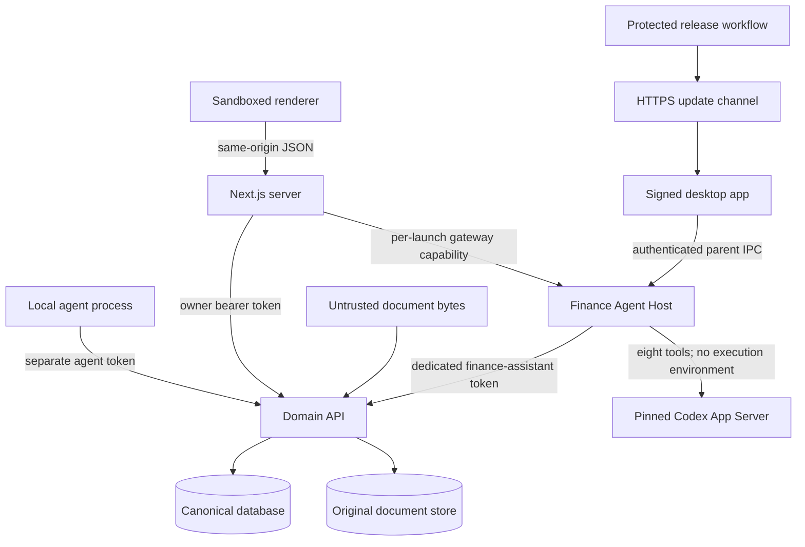

# Chelaro Threat Model

Status: Preview baseline · 28 August 2026

This document describes implemented controls and known gaps. It is not a claim of complete
security, regulatory compliance, or protection against every local attacker.

## Assets

1. Original financial documents and their content hashes.
2. Canonical transactions, receivables, workbook records, and audit history.
3. Owner and agent bearer tokens.
4. Local database and document directories.
5. macOS signing identity, Apple notarization credentials, and update-channel credentials.
6. Release artifacts and update metadata.
7. Finance-assistant consent history and per-launch API/gateway capabilities.
8. The app-owned Codex home, pinned App Server identity, and exact finance-tool policy.

## Trust boundaries

Document text, filenames, MIME headers, OCR results, imported transaction descriptions, and agent
messages are untrusted input.

## Threats and controls

| Threat | Current controls | Residual risk / next control |
| --- | --- | --- |
| Uploaded executable disguised as a document | Byte-signature detection; PDF/PNG/JPEG allowlist; size limit; quarantine; safe filename | Add malware scanning before broader distribution |
| Path traversal through filenames or storage keys | Basename normalization; content-addressed keys; resolved-path containment check | Continue fuzzing unusual Unicode and platform paths |
| Silent alteration of an original | Immutable content-addressed storage; derived metadata stored separately | Add periodic integrity verification and backup manifests |
| Assistant writes canonical financial data | Dedicated least-privilege principal; owner-only routes reject it; four write tools create reviewable proposals; existing-record changes remain version-bound; approval/rejection remains owner-only and audited | Continue adding proposal-action-specific regression tests |
| Model-driven tool exceeds finance scope | Exact eight-tool provider manifest; no execution environment; no shell/files/web/browser/MCP/plugins; bounded schemas, call binding, turn/session budgets, and consent checks before and after every call | The trusted same-user App Server remains residual risk; packaged integration requires a new review |
| Finance data is sent without current consent | Append-only owner-only consent journal; notice/version/category binding; `revoke_pending` is fsynced before interrupt and further transfers fail closed | Provider-side retention is governed outside Chelaro and must remain disclosed |
| Assistant capability leaks to Codex or renderer | Generated per launch; delivered to Host post-start by inherited IPC; removed from child environments; different gateway token held only by Electron and Next.js | Same-user process compromise remains outside logical token separation |
| Replaced or reconfigured Codex control plane | Exact dependency pin; macOS version/architecture, executable, version, hash, and Developer ID verification; app-owned empty configuration; fail-closed startup | The verified App Server remains a trusted process under the same OS user; revisit before packaged or multi-platform release |
| Stale or conflicting financial writes | Expected-version checks; transactional changes; audit events | Add conflict telemetry without sensitive payloads |
| Token theft from source, logs, or fixtures | Environment-based secrets; repository safety scan; synthetic fixtures | Move desktop credentials to Keychain where persistent credentials become necessary |
| Cross-origin browser mutation | Same-origin validation; JSON-only bounded commands; explicit route allowlist; bearer capabilities remain server-side; gateway rejects Origin and cookies | Keep browser and proxy regression tests mandatory |
| Renderer takeover reaching Node.js | Electron sandbox; context isolation; Node integration disabled; restricted navigation and IPC sender validation | Maintain Electron security review on every major update |
| Malicious or incomplete update | HTTPS channel; manual download/install; Developer ID signing; notarization and stapling checks; versioned artifacts published before metadata | Add artifact provenance/attestations when available on the GitHub plan |
| Database loss or corruption | Migration history and transactional domain writes | Automated encrypted backup and tested restore are still required |
| Compromised local OS account | Loopback-only services and private filesystem permissions reduce exposure | Full protection is out of scope; local database is not encrypted at rest |
| Supply-chain dependency compromise | Lockfiles, SHA-pinned GitHub Actions, dependency audits, Dependabot | Restore mandatory CI checks and enable all available repository scanning |

## Security invariants

- Original files are never replaced by derived output.
- Unverified automation never becomes canonical by implication.
- An agent mutation is a proposal unless a narrowly documented deterministic path says otherwise.
- Money never uses binary floating-point representation.
- A financial mutation and its audit event succeed or fail together.
- Deleting a workbook row cannot cascade to its source document.

## Logging and diagnostics

Logs may contain request identifiers, lifecycle events, status codes, and bounded technical error
messages. They must not contain document content, bearer tokens, database passwords, signed URLs, or
raw financial payloads. Screenshots and recordings used in documentation must contain only
synthetic data.

## Release-secret inventory

The release workflow expects the following GitHub environment secrets:

- `MACOS_CERTIFICATE_P12_BASE64`
- `MACOS_CERTIFICATE_PASSWORD`
- `APPLE_API_KEY_P8_BASE64`
- `APPLE_API_KEY_ID`
- `APPLE_API_ISSUER`
- `UPDATE_AWS_ACCESS_KEY_ID`
- `UPDATE_AWS_SECRET_ACCESS_KEY`

It also expects update-channel variables documented in the release process. Secret values are
never committed or printed by validation steps.

## Review cadence

Review this model before:

- a public release;
- enabling OCR or an agent write capability;
- changing local storage, backups, authentication, or update delivery;
- adding a new external processor;
- any Electron, database, or runtime major upgrade.
